# `ui`

React components for the EHR product suite. Five components, one entry point,
one stylesheet, no styling framework required.

| Component | Use it for |
| --- | --- |
| [Button](#button) | Triggering an action. |
| [TextField](#textfield) | Entering a single line of text, with a label, a hint and an error. |
| [Card](#card) | Grouping related content under an optional title. |
| [Table](#table) | Showing many records as rows, optionally clickable. |
| [DescriptionList](#descriptionlist) | Showing one record's details as label/value pairs. |

Links written as `src/components/Button.tsx:26` open the code a statement is
about, at that line. They are checked: a test fails if one points past the end
of its file or at a line that no longer holds the code it names
(`src/readme.test.ts`), and the same test keeps the contents list below in step
with the headings.

## Contents

1. [Getting started](#getting-started)
   - [Requirements](#requirements)
   - [Install](#install)
   - [Use](#use)
2. [A real screen: patient lookup](#a-real-screen-patient-lookup)
3. [Styling](#styling)
   - [The contract](#the-contract)
   - [Tokens](#tokens)
   - [How a component uses them](#how-a-component-uses-them)
4. [Component reference](#component-reference)
   - [Button](#button)
   - [TextField](#textfield)
   - [Card](#card)
   - [Table](#table)
   - [DescriptionList](#descriptionlist)
5. [Contributing: extending the library](#contributing-extending-the-library)
   - [Start with the scaffold](#start-with-the-scaffold)
   - [1. Write the component](#1-write-the-component)
   - [2. Style it from tokens](#2-style-it-from-tokens)
   - [3. Make it accessible](#3-make-it-accessible)
   - [4. Test its behaviour](#4-test-its-behaviour)
   - [5. Give it a story per state](#5-give-it-a-story-per-state)
   - [6. Export its types](#6-export-its-types)
   - [7. Document it here](#7-document-it-here)
   - [8. Check it](#8-check-it)
   - [Why adding a component is this short](#why-adding-a-component-is-this-short)

---

## Getting started

### Requirements

- **React 19** and **React DOM 19**, as peer dependencies. The library does not
  bundle React ([`vite.config.ts:23`](vite.config.ts#L23 "external: ['react', 'react-dom', 'react/jsx-runtime'],")), so your app's copy is the only one on the page.
- A bundler that understands package `exports` and CSS imports — Vite,
  webpack 5, or anything equivalent.

### Install

The package is not published to a registry. It is consumed as a package all the
same — by name, from its build output — never as a folder of source files.

**Inside this repository** (an npm workspace), add it to the consuming
package's dependencies and reinstall at the root:

```jsonc
// packages/your-app/package.json
"dependencies": {
  "ui": "*"
}
```

```bash
npm install                      # at the repository root
npm run build --workspace ui     # builds packages/ui/dist, which consumers import
```

**From another repository**, build a tarball and install that:

```bash
npm run build --workspace ui
npm pack --workspace ui          # writes ui-0.1.0.tgz
cd ../your-app && npm install ../path/to/ui-0.1.0.tgz
```

The library must be built before a consumer can import it; the package's
`exports` ([`package.json:9`](package.json#L9 "exports")) point at `dist/`. After changing the library, rebuild it. While
working on it, `npm run dev --workspace ui` rebuilds the JavaScript and CSS on
save; run the full build again when a prop or type changes, so the type
declarations follow.

### Use

A consumer needs exactly two imports: the stylesheet, **once**, at your app's
root, and components from the package entry point wherever you use them.

```tsx
// main.tsx — your app's root
import { StrictMode } from 'react';
import { createRoot } from 'react-dom/client';
import 'ui/styles.css';
import { App } from './App';

createRoot(document.getElementById('root') as HTMLElement).render(
  <StrictMode>
    <App />
  </StrictMode>,
);
```

```tsx
// App.tsx
import { useState } from 'react';
import { Button, Card, TextField } from 'ui';

export function App() {
  const [name, setName] = useState('');

  return (
    <Card title="Find a patient">
      <TextField label="Name" value={name} onChange={setName} />
      <Button onClick={() => console.log('search for', name)}>Search</Button>
    </Card>
  );
}
```

Import only from `'ui'` and `'ui/styles.css'`. Those are the package's only
public paths; anything else — `ui/src/...`, `ui/dist/...`, a relative path into
the library — is refused by the package's `exports` map and is not part of the
API.

Prop types are exported alongside the components, for typing your own
wrappers:

| Export | What it is |
| --- | --- |
| `ButtonProps`, `ButtonVariant`, `ButtonSize` | Button's props, and its `variant` and `size` unions. |
| `TextFieldProps` | TextField's props. |
| `CardProps` | Card's props. |
| `TableProps`, `TableColumn`, `TableRow` | Table's props, one column definition, one row. |
| `DescriptionListProps`, `DescriptionListItem` | DescriptionList's props, one label/value item. |

## A real screen: patient lookup

The component reference below shows each component alone. This is all five
working together the way a product screen uses them: a search form in a
`Card`, results in a `Table`, the chosen record in a `DescriptionList`, and
the loading, validation, empty and failure cases each handled by the
component that owns them.

Run it with `npm run storybook` and open **Examples / Patient lookup**. Search
`lo` for results, `zz` for none, `error` for a failed request, or a single
letter for the validation error, then click a row.

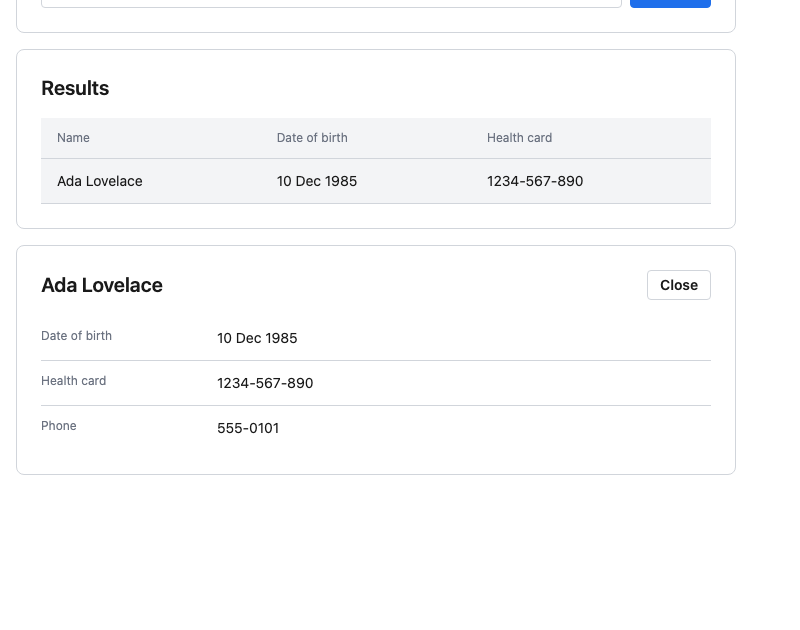

What to notice:

- **The screen holds the data; the components hold the states.** The screen
  never styles a loading button, a focused row or an error border. It passes
  `loading`, `errorMessage` or `emptyMessage` and the component does the rest.
- **One `primary` button.** Search is the screen's main action; Try again and
  Close are `secondary` and `sm` because they sit in a card header.
- **Missing values.** `DescriptionList` shows `—` for a missing value on its
  own; `Table` prints cells exactly as given, so the screen maps a missing
  health card to `—` itself.
- **Layout is yours.** The `div`s with inline grid and flex styles are the
  screen's layout. They position components; they never restyle them.

The listing is the source of the story, apart from the import path, and a test
fails if the two drift apart.

<!-- example:PatientLookup -->
```tsx
import { useState, type FormEvent } from 'react';
import { Button, Card, DescriptionList, Table, TextField, type TableRow } from 'ui';

interface Patient {
  id: string;
  name: string;
  dateOfBirth: string;
  healthCardNumber?: string;
  phone?: string;
}

const PATIENTS: Patient[] = [
  { id: 'p1', name: 'Ada Lovelace', dateOfBirth: '10 Dec 1985', healthCardNumber: '1234-567-890', phone: '555-0101' },
  { id: 'p2', name: 'Alan Turing', dateOfBirth: '23 Jun 1972', phone: '555-0102' },
  { id: 'p3', name: 'Grace Hopper', dateOfBirth: '9 Dec 1966', healthCardNumber: '9876-543-210' },
];

/** Stands in for a real API call: answers after a short delay, and fails for "error". */
function searchPatients(query: string): Promise<Patient[]> {
  return new Promise((resolve, reject) => {
    setTimeout(() => {
      if (query.toLowerCase() === 'error') {
        reject(new Error('Search failed'));
      } else {
        resolve(PATIENTS.filter((patient) => patient.name.toLowerCase().includes(query.toLowerCase())));
      }
    }, 300);
  });
}

const columns = [
  { key: 'name', header: 'Name' },
  { key: 'dateOfBirth', header: 'Date of birth' },
  { key: 'healthCardNumber', header: 'Health card' },
];

export function PatientLookup() {
  const [query, setQuery] = useState('');
  const [queryError, setQueryError] = useState('');
  const [loading, setLoading] = useState(false);
  const [failed, setFailed] = useState(false);
  const [results, setResults] = useState<Patient[] | null>(null);
  const [selected, setSelected] = useState<Patient | null>(null);

  async function search(event?: FormEvent) {
    event?.preventDefault();
    if (query.trim().length < 2) {
      setQueryError('Enter at least two characters.');
      return;
    }
    setQueryError('');
    setLoading(true);
    setFailed(false);
    setSelected(null);
    try {
      setResults(await searchPatients(query.trim()));
    } catch {
      setResults(null);
      setFailed(true);
    } finally {
      setLoading(false);
    }
  }

  // Table cells show exactly what they are given, so the screen decides how a
  // missing value reads. DescriptionList does this itself.
  const rows: TableRow[] = (results ?? []).map((patient) => ({
    id: patient.id,
    name: patient.name,
    dateOfBirth: patient.dateOfBirth,
    healthCardNumber: patient.healthCardNumber ?? '—',
  }));

  return (
    <div style={{ display: 'grid', gap: 16, maxWidth: 720 }}>
      <Card title="Find a patient">
        <form onSubmit={search} style={{ display: 'flex', gap: 8, alignItems: 'flex-start' }}>
          <div style={{ flex: 1 }}>
            <TextField
              label="Name"
              value={query}
              onChange={setQuery}
              placeholder="At least two letters, e.g. Lo"
              errorMessage={queryError}
            />
          </div>
          {/* Drops the button to the input's line: the label's 16px line plus the field's 4px gap. */}
          <div style={{ paddingTop: 20 }}>
            <Button type="submit" loading={loading}>
              Search
            </Button>
          </div>
        </form>
      </Card>

      {failed ? (
        <Card title="Results" actions={<Button variant="secondary" size="sm" onClick={() => search()}>Try again</Button>}>
          <p>Something went wrong. Your search was not run.</p>
        </Card>
      ) : null}

      {results ? (
        <Card title="Results">
          <Table
            columns={columns}
            rows={rows}
            emptyMessage="No patients match that name"
            onRowClick={(row) => setSelected(results.find((patient) => patient.id === row.id) ?? null)}
          />
        </Card>
      ) : null}

      {selected ? (
        <Card
          title={selected.name}
          actions={<Button variant="secondary" size="sm" onClick={() => setSelected(null)}>Close</Button>}
        >
          <DescriptionList
            items={[
              { label: 'Date of birth', value: selected.dateOfBirth },
              { label: 'Health card', value: selected.healthCardNumber },
              { label: 'Phone', value: selected.phone },
            ]}
          />
        </Card>
      ) : null}
    </div>
  );
}
```

---

## Styling

### The contract

- **You choose a variant or a size; the library owns the appearance.** No
  component takes a colour, a pixel value, a `className` or a `style` prop.
- **Component internals are private.** Class names are generated at build time
  (`ui-button-BiD3F`, [`vite.config.ts:11`](vite.config.ts#L11 "generateScopedName: 'ui-[local]-[hash:base64:5]',")) and change between builds. Do not target them, and do not
  write selectors that reach inside a component.
- **Tokens are public.** Every colour, spacing, radius and type value is a CSS
  custom property on `:root`, defined once in `src/tokens.css` ([`src/tokens.css:13`](src/tokens.css#L13 ":root {")) and shipped in
  `ui/styles.css`. Your own layout CSS can and should use them, so a page sits
  on the same scale as the components.

```css
/* Your app's own layout — tokens, not literals. */
.page {
  display: flex;
  flex-direction: column;
  gap: var(--ui-space-6);
  padding: var(--ui-space-8) var(--ui-space-4);
  font-family: var(--ui-font-family);
}
```

**Theming.** Redefining a token on `:root` after importing `ui/styles.css`
changes it everywhere, for every component, consistently. That is a deliberate
escape hatch for a product-wide theme, not a way to restyle one component.

### Tokens

**Colour**

| Token | Custom property | Value | Used for |
| --- | --- | --- | --- |
| color.primary | `--ui-color-primary` | `#1F6FEB` | Primary buttons, focused input border |
| color.primary.hover | `--ui-color-primary-hover` | `#185CC4` | Primary button hover |
| color.danger | `--ui-color-danger` | `#C93C37` | Error border and message |
| color.text | `--ui-color-text` | `#1A1A1A` | Body text |
| color.text.muted | `--ui-color-text-muted` | `#6B7280` | Labels, helper text, headers, empty values |
| color.border | `--ui-color-border` | `#D1D5DB` | Borders and row dividers |
| color.focus | `--ui-color-focus` | `#93C5FD` | Focus ring |
| color.surface | `--ui-color-surface` | `#FFFFFF` | Card and input background |
| color.surface.subtle | `--ui-color-surface-subtle` | `#F3F4F6` | Table header, hovered rows and secondary buttons |
| color.disabled.bg | `--ui-color-disabled-bg` | `#E5E7EB` | Disabled background |
| color.disabled.text | `--ui-color-disabled-text` | `#9CA3AF` | Disabled text |

**Spacing**

| Token | Custom property | Value |
| --- | --- | --- |
| space.1 | `--ui-space-1` | `4px` |
| space.2 | `--ui-space-2` | `8px` |
| space.3 | `--ui-space-3` | `12px` |
| space.4 | `--ui-space-4` | `16px` |
| space.6 | `--ui-space-6` | `24px` |
| space.8 | `--ui-space-8` | `32px` |

**Radius**

| Token | Custom property | Value |
| --- | --- | --- |
| radius.sm | `--ui-radius-sm` | `4px` |
| radius.md | `--ui-radius-md` | `8px` |

**Typography** — each role is a size, a line height and a weight.

| Token | Size | Line height | Weight | Custom properties |
| --- | --- | --- | --- | --- |
| font.body | `14px` | `20px` | 400 | `--ui-font-body-size`, `-line`, `-weight` |
| font.label | `12px` | `16px` | 400 | `--ui-font-label-size`, `-line`, `-weight` |
| font.button | `14px` | `20px` | 600 | `--ui-font-button-size`, `-line`, `-weight` |
| font.heading | `20px` | `28px` | 600 | `--ui-font-heading-size`, `-line`, `-weight` |
| font.title | `24px` | `32px` | 600 | `--ui-font-title-size`, `-line`, `-weight` |

The font stack is `--ui-font-family` (the platform's system UI font).

**Focus ring** — one definition, used by every focusable component:
`--ui-focus-ring-width` (`2px`) and `--ui-focus-ring-offset` (`2px`), drawn in
`--ui-color-focus`.

### How a component uses them

Each component has one CSS Module beside it, and every value in it is a
`var(--ui-…)` reference:

```css
/* Button.module.css (excerpt) */
.md {
  padding: var(--ui-space-2) var(--ui-space-4);
}

.primary {
  background: var(--ui-color-primary);
  color: var(--ui-color-surface);
}

.button:focus-visible {
  outline: var(--ui-focus-ring-width) solid var(--ui-color-focus);
  outline-offset: var(--ui-focus-ring-offset);
}
```

The token sheet has no border width, so hairline borders are a literal `1px`,
and each literal in a component stylesheet carries a comment saying why no
token fits. A new component that follows these rules matches the existing
five by construction — see [Contributing: extending the library](#contributing-extending-the-library).

---

## Component reference

Every prop in each table exists in the code, and every prop in the code is in a
table. Every example runs as written inside a component tree whose root
imports `ui/styles.css`.

### Button

A clickable button that triggers an action. Two visual weights, two sizes, and
built-in busy and unavailable states.

#### Source

Component [`src/components/Button.tsx:26`](src/components/Button.tsx#L26 "export function Button({") · props [`src/components/Button.tsx:7`](src/components/Button.tsx#L7 "export interface ButtonProps {") · styles [`Button.module.css`](src/components/Button.module.css) · tests [`Button.test.tsx`](src/components/Button.test.tsx) · stories [`Button.stories.tsx`](src/components/Button.stories.tsx)

#### Props

| Prop | Type | Default | Description |
| --- | --- | --- | --- |
| `variant` | `'primary' \| 'secondary'` | `'primary'` | Visual weight. `primary` is the main action on a screen; everything else is `secondary`. |
| `size` | `'sm' \| 'md'` | `'md'` | Control height and padding. `sm` for dense places such as a card's header row. |
| `loading` | `boolean` | `false` | Shows a spinner in place of the label and makes the button non-interactive. The width does not change. |
| `disabled` | `boolean` | `false` | Makes the button non-interactive and renders it in the disabled palette. |
| `onClick` | `() => void` | — | Called on click, Enter or Space. Never called while `loading` or `disabled`. |
| `children` | `ReactNode` | required | The button's label. |
| `type` | `'button' \| 'submit' \| 'reset'` | `'button'` | Native button type. Use `'submit'` to submit a surrounding `<form>`; the default never submits one by accident. |
| `aria-label` | `string` | — | Accessible name, for when the visible label alone is not descriptive enough (for example, several "Edit" buttons on one page). |

#### Example

```tsx
import { useState } from 'react';
import { Button } from 'ui';

export function SaveOrCancel() {
  const [saving, setSaving] = useState(false);

  function save() {
    setSaving(true);
    // Stand-in for a real request.
    setTimeout(() => setSaving(false), 1500);
  }

  return (
    <div>
      <Button variant="secondary" disabled={saving} onClick={() => console.log('cancelled')}>
        Cancel
      </Button>
      <Button loading={saving} onClick={save}>
        Save
      </Button>
    </div>
  );
}
```

#### Behaviour

**Behaviour you get for free.** `loading` and `disabled` both set the native
`disabled` attribute ([`src/components/Button.tsx:38`](src/components/Button.tsx#L38 "const isInteractive = !loading && !disabled;")), so the button cannot be clicked, reached with Tab or
activated from the keyboard. A loading button keeps its variant colours and its
accessible name, and is announced as busy (`aria-busy`, [`src/components/Button.tsx:52`](src/components/Button.tsx#L52 "aria-busy={loading || undefined}")).

#### States

Every state below is produced by props or by the user; you never style one
yourself. The story column names the Storybook story that shows it
(`npm run storybook`); hover and focus are interactions on that story.

| State | How you get it | What it looks like | Story | Picture |
| --- | --- | --- | --- | --- |
| Primary | `variant="primary"` (default) | `--ui-color-primary` fill and border, white (`--ui-color-surface`) label, `--ui-radius-sm` corners. | Button / Primary | 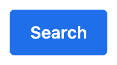 |
| Primary, hover | Pointer over an enabled primary button | Fill and border darken to `--ui-color-primary-hover`. | Button / Primary, hovered |  |
| Focus | Tab to the button | A `--ui-focus-ring-width` ring in `--ui-color-focus`, offset `--ui-focus-ring-offset` outside the border. Keyboard focus only, not on click. | Button / Primary, tabbed to |  |
| Secondary | `variant="secondary"` | `--ui-color-surface` fill, `--ui-color-border` border, `--ui-color-text` label. | Button / Secondary | 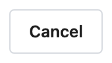 |
| Secondary, hover | Pointer over an enabled secondary button | Fill changes to `--ui-color-surface-subtle`. | Button / Secondary, hovered | 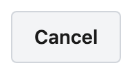 |
| Small | `size="sm"` | Padding drops from `--ui-space-2` × `--ui-space-4` to `--ui-space-1` × `--ui-space-3`. Same type size. | Button / Small | 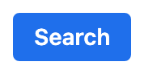 |
| Loading | `loading` | Label turns transparent but keeps its space, so the width does not change; a spinner in the label colour sits on top. Variant colours stay. Not clickable, not tabbable, announced busy. | Button / Loading | 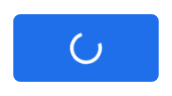 |
| Disabled | `disabled` | `--ui-color-disabled-bg` fill and border, `--ui-color-disabled-text` label, default cursor, no hover change. Not clickable, not tabbable. | Button / Disabled | 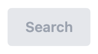 |

#### When to use it

For an action: save, search, submit, open a dialog. Use one
`primary` button per screen or section, for the action the user most likely
wants; make the rest `secondary`. Show `loading` for the duration of an
asynchronous action rather than disabling the button and adding a separate
spinner.

**When not to.** For navigating to another page — use a link, so it opens in a
new tab and reads as navigation to assistive technology. And not for toggling a
setting on and off.

### TextField

A single-line text input with a label above it, an optional hint below it, and
an error state. The field is controlled: you hold the value.

#### Source

Component [`src/components/TextField.tsx:21`](src/components/TextField.tsx#L21 "export function TextField({") · props [`src/components/TextField.tsx:4`](src/components/TextField.tsx#L4 "export interface TextFieldProps {") · styles [`TextField.module.css`](src/components/TextField.module.css) · tests [`TextField.test.tsx`](src/components/TextField.test.tsx) · stories [`TextField.stories.tsx`](src/components/TextField.stories.tsx)

#### Props

| Prop | Type | Default | Description |
| --- | --- | --- | --- |
| `label` | `string` | required | Visible label, rendered above the input and associated with it. |
| `value` | `string` | required | The current value. |
| `onChange` | `(value: string) => void` | required | Called with the new value on every keystroke. Receives the string, not the event. |
| `placeholder` | `string` | — | A short example of the expected input. Not a substitute for the label. |
| `helperText` | `string` | — | A hint below the input. Hidden while an error is showing. |
| `errorMessage` | `string` | — | An error to show below the input. A non-empty string puts the field in its error state; `undefined` or `''` clears it. |
| `disabled` | `boolean` | `false` | Makes the input non-interactive and renders it in the disabled palette. |

#### Example

```tsx
import { useState } from 'react';
import { TextField } from 'ui';

export function EmailField() {
  const [email, setEmail] = useState('');
  const error =
    email !== '' && !email.includes('@') ? 'Enter an email address, like name@example.com' : undefined;

  return (
    <TextField
      label="Email"
      value={email}
      onChange={setEmail}
      placeholder="name@example.com"
      helperText="Used for appointment reminders only."
      errorMessage={error}
    />
  );
}
```

#### Behaviour

**Behaviour you get for free.** The label is tied to the input by a generated id
([`src/components/TextField.tsx:30`](src/components/TextField.tsx#L30 "const id = useId();")), so clicking it focuses the input and screen
readers announce it; two fields on one page never share an id. In the error state the border turns `color.danger`, the message
replaces the helper text rather than stacking under it ([`src/components/TextField.tsx:36`](src/components/TextField.tsx#L36 "const message = hasError ? errorMessage : helperText;")), it is announced
(`role="alert"`, [`src/components/TextField.tsx:60`](src/components/TextField.tsx#L60 "role={hasError ? 'alert' : undefined}")), and the input is marked invalid and described by it.

#### States

| State | How you get it | What it looks like | Story | Picture |
| --- | --- | --- | --- | --- |
| Default | No `errorMessage`, not `disabled` | Label in `--ui-color-text-muted` at label size above a `--ui-color-surface` input with a `--ui-color-border` border; placeholder in `--ui-color-text-muted`. | TextField / Default | 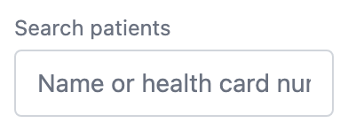 |
| Focus | Click or Tab into the input | Border turns `--ui-color-primary`, plus a `--ui-focus-ring-width` ring in `--ui-color-focus`. | TextField / Default, tabbed to | 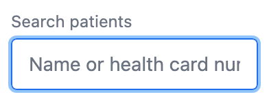 |
| With hint | `helperText="…"` | The hint sits under the input in `--ui-color-text-muted` at label size, and is read out as the input's description. | TextField / With Helper Text | 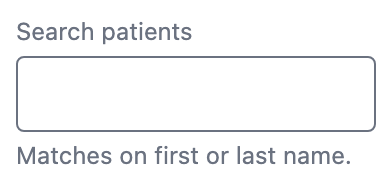 |
| Error | A non-empty `errorMessage` | Border turns `--ui-color-danger`, also while focused. The message replaces the hint, in `--ui-color-danger`, is announced (`role="alert"`) and the input is marked `aria-invalid`. An empty string is not an error. | TextField / With Error | 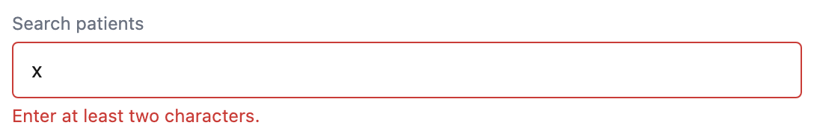 |
| Disabled | `disabled` | `--ui-color-disabled-bg` fill, `--ui-color-disabled-text` text. The input cannot be focused or typed in, and Tab skips it. | TextField / Disabled | 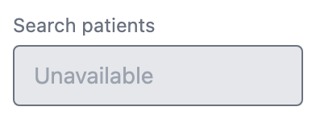 |

#### When to use it

For short free text: a name, a search term, an email, a
phone number. Pass an `errorMessage` once you know the value is wrong — on
submit, or on blur — and clear it when the user fixes it.

**When not to.** For multi-line text, or for choosing from a fixed set of
values. There is no textarea, select or checkbox in the library yet; those are
new components, not TextField options.

### Card

A bordered container that groups related content on a page, with an optional
title and an optional slot for actions on the title's row.

#### Source

Component [`src/components/Card.tsx:13`](src/components/Card.tsx#L13 "export function Card({ title, actions, children }: CardProps") · props [`src/components/Card.tsx:4`](src/components/Card.tsx#L4 "export interface CardProps {") · styles [`Card.module.css`](src/components/Card.module.css) · tests [`Card.test.tsx`](src/components/Card.test.tsx) · stories [`Card.stories.tsx`](src/components/Card.stories.tsx)

#### Props

| Prop | Type | Default | Description |
| --- | --- | --- | --- |
| `title` | `string` | — | Heading shown at the top of the card. Omit for an untitled container. |
| `actions` | `ReactNode` | — | Controls shown right-aligned on the title row, typically `sm` Buttons. |
| `children` | `ReactNode` | required | The card's body. |

#### Example

```tsx
import { Button, Card, DescriptionList } from 'ui';

export function AllergiesCard() {
  return (
    <Card
      title="Allergies"
      actions={
        <Button variant="secondary" size="sm" onClick={() => console.log('edit allergies')}>
          Edit
        </Button>
      }
    >
      <DescriptionList
        items={[
          { label: 'Penicillin', value: 'Rash, moderate' },
          { label: 'Latex', value: 'Contact dermatitis' },
        ]}
      />
    </Card>
  );
}
```

#### Behaviour

**Layout.** The title renders as an `h2` in `font.heading`. The title row is
left out entirely when there is neither a `title` nor `actions`
([`src/components/Card.tsx:14`](src/components/Card.tsx#L14 "const hasHeader = Boolean(title) || Boolean(actions);")), so an untitled
card has no stray space above its body.

#### States

A Card has no interactive states; its header row is the only thing that
changes, and it is driven by which props you pass.

| State | How you get it | What it looks like | Story | Picture |
| --- | --- | --- | --- | --- |
| Body only | No `title`, no `actions` | A `--ui-color-surface` box with a `--ui-color-border` hairline, `--ui-radius-md` corners and `--ui-space-6` padding. No header row at all. | Card / Default | 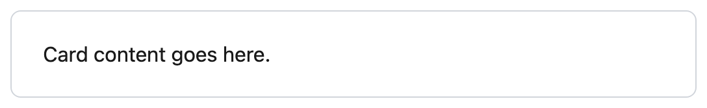 |
| With title | `title="…"` | A level-2 heading at heading size above the body, `--ui-space-4` below it. | Card / With Title | 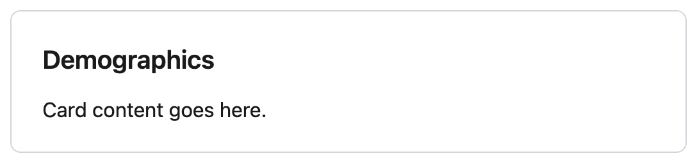 |
| With title and actions | `title` and `actions` | The actions sit hard right on the title's row, `--ui-space-2` apart. With `actions` but no `title`, they still sit right. | Card / With Title And Actions | 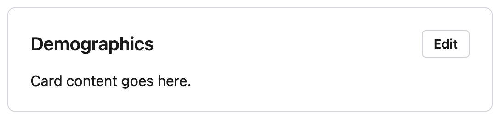 |

#### When to use it

To group a section of a page that belongs together — a
search form, a record's demographics, an error message that replaces a
section. A card's title names what is in it.

**When not to.** Around a whole page, or nested inside another card. If
everything on a page is in cards, nothing is grouped.

### Table

A data table: a header row of column names and one body row per record. Rows
can be clickable, and a message shows when there are no rows.

#### Source

Component [`src/components/Table.tsx:24`](src/components/Table.tsx#L24 "export function Table({") · props [`src/components/Table.tsx:13`](src/components/Table.tsx#L13 "export interface TableProps {") · styles [`Table.module.css`](src/components/Table.module.css) · tests [`Table.test.tsx`](src/components/Table.test.tsx) · stories [`Table.stories.tsx`](src/components/Table.stories.tsx)

#### Props

| Prop | Type | Default | Description |
| --- | --- | --- | --- |
| `columns` | `TableColumn[]` — `{ key: string; header: string }[]` | required | The columns, in display order. `header` is the column's heading; `key` is looked up on each row. |
| `rows` | `TableRow[]` — `Record<string, ReactNode>[]` | required | One entry per record. Each cell is `row[column.key]`. Keys that no column names are carried but not shown. |
| `onRowClick` | `(row: TableRow) => void` | — | Makes rows clickable by mouse and keyboard, and is called with the clicked row. |
| `emptyMessage` | `string` | `'No results'` | Shown in place of the body when `rows` is empty. |

#### Example

```tsx
import { Table } from 'ui';
import type { TableColumn, TableRow } from 'ui';

const columns: TableColumn[] = [
  { key: 'medication', header: 'Medication' },
  { key: 'dose', header: 'Dose' },
  { key: 'frequency', header: 'Frequency' },
];

const rows: TableRow[] = [
  { id: 'rx-1', medication: 'Metformin', dose: '500 mg', frequency: 'Twice daily' },
  { id: 'rx-2', medication: 'Lisinopril', dose: '10 mg', frequency: 'Once daily' },
];

export function MedicationsTable() {
  return (
    <Table
      columns={columns}
      rows={rows}
      emptyMessage="No active medications"
      onRowClick={(row) => console.log('open prescription', row.id)}
    />
  );
}
```

The `id` key above is not a column, so it is not shown, but it comes back in
`onRowClick` — the usual way to know which record was clicked. Its type is
`ReactNode`, so narrow it (`typeof row.id === 'string'`) before using it as a
string.

#### Behaviour

**Behaviour you get for free.** With `onRowClick` set, rows highlight on hover,
show a pointer, and join the tab order ([`src/components/Table.tsx:59`](src/components/Table.tsx#L59 "tabIndex={isClickable ? 0 : undefined}")); a focused row activates with Enter or
Space ([`src/components/Table.tsx:64`](src/components/Table.tsx#L64 "if (event.key === 'Enter' || event.key === ' ') {")) and shows the focus ring. Without it, rows are static and none of that
applies. Clickable rows keep their table semantics, so screen readers can still
move through the table by row and column.

**Cells render exactly what you give them.** A `null` or `undefined` cell is
empty; the Table does not substitute a dash. If a column can be missing, decide
what it should show before building the row.

#### States

| State | How you get it | What it looks like | Story | Picture |
| --- | --- | --- | --- | --- |
| Default | `rows` with entries, no `onRowClick` | Header row on `--ui-color-surface-subtle` in `--ui-color-text-muted` at label size; body cells at body size; a `--ui-color-border` hairline under every row. Rows are not focusable. | Table / Default | 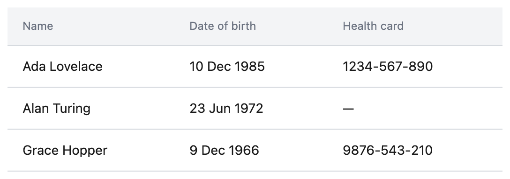 |
| Row hover | `onRowClick` set, pointer over a row | The row fills with `--ui-color-surface-subtle` and the cursor becomes a pointer. | Table / Clickable Rows, hovered | 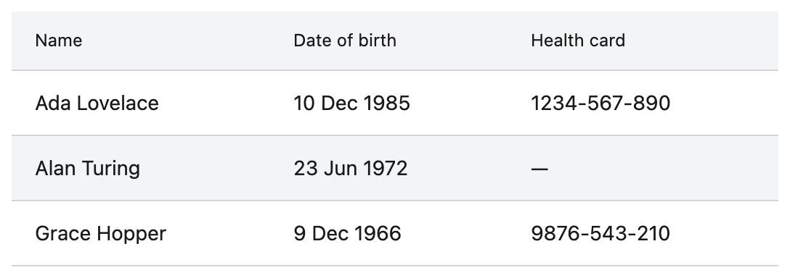 |
| Row focus | `onRowClick` set, Tab to a row | Same fill, plus a `--ui-color-focus` ring drawn inside the row. Enter or Space calls `onRowClick`. | Table / Clickable Rows, tabbed to | 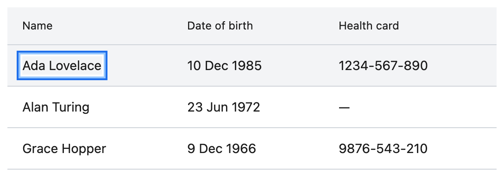 |
| Empty | `rows={[]}` | One full-width cell, centred, in `--ui-color-text-muted`, with `--ui-space-8` above and below. Shows `emptyMessage` (default "No results"). Never clickable. | Table / Empty | 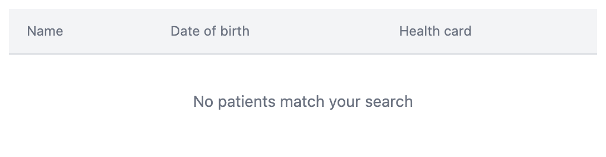 |

#### When to use it

For many records of the same shape that a user scans,
compares, or picks one of — a patient list, a medication list, a results
list.

**When not to.** For one record's details (use
[DescriptionList](#descriptionlist)), or for page layout. The Table does not
sort, paginate or filter; do that before passing `rows`.

### DescriptionList

A read-only list of label/value pairs, one per row, for showing the details of
a single record — the read-only counterpart to a form.

#### Source

Component [`src/components/DescriptionList.tsx:23`](src/components/DescriptionList.tsx#L23 "export function DescriptionList({ items }: DescriptionListPr") · props [`src/components/DescriptionList.tsx:14`](src/components/DescriptionList.tsx#L14 "export interface DescriptionListProps {") · styles [`DescriptionList.module.css`](src/components/DescriptionList.module.css) · tests [`DescriptionList.test.tsx`](src/components/DescriptionList.test.tsx) · stories [`DescriptionList.stories.tsx`](src/components/DescriptionList.stories.tsx)

#### Props

| Prop | Type | Default | Description |
| --- | --- | --- | --- |
| `items` | `DescriptionListItem[]` — `{ label: string; value: ReactNode }[]` | required | The label/value pairs, one row each, in display order. A value that is `null`, `undefined` or `''` renders as `—`. |

#### Example

```tsx
import { DescriptionList } from 'ui';

export function ContactDetails() {
  return (
    <DescriptionList
      items={[
        { label: 'Phone', value: '+1 416 555 0133' },
        { label: 'Email', value: null },
        { label: 'Preferred language', value: 'English' },
      ]}
    />
  );
}
```

#### Behaviour

**Missing values.** Pass a missing value as `null` (or `undefined`, or `''`)
and it renders as an em dash in `color.text.muted`
([`src/components/DescriptionList.tsx:19`](src/components/DescriptionList.tsx#L19 "function isEmpty(value: ReactNode): boolean {")) — never blank and never the
text "undefined". Do not substitute the dash yourself; what "missing" looks
like is the library's decision. `0` is a value, not a missing one, and renders
as `0`.

**Layout.** Labels sit in a fixed 160px column in `font.label`, values to their
right in `font.body`, and rows are divided by a border except after the last.
Labels are the row keys, so keep them unique within one list.

#### States

| State | How you get it | What it looks like | Story | Picture |
| --- | --- | --- | --- | --- |
| Default | Every `value` present | Label in a fixed 160px column in `--ui-color-text-muted` at label size; value in `--ui-color-text` at body size; a `--ui-color-border` hairline between rows. | DescriptionList / Default | 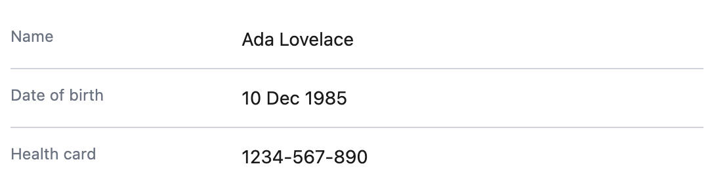 |
| Missing value | A `value` of `null`, `undefined` or `''` | The value shows an em dash (`—`) in `--ui-color-text-muted`. `0` is a value and shows as `0`. | DescriptionList / Missing Values | 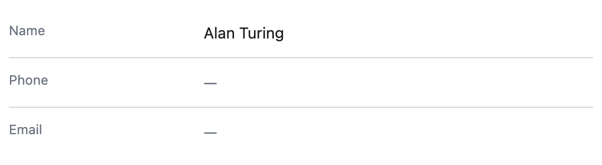 |

#### When to use it

To show one record's fields: demographics, contact
details, an encounter summary. It usually sits inside a [Card](#card).

**When not to.** For many records (use [Table](#table)), or for fields the user
edits (use [TextField](#textfield)).

---

## Contributing: extending the library

How to add a sixth component so it fits with the existing five. It starts
from one command, walks through turning what that command generates into a
real component (a `Badge`), and ends with why each step is short. The house
style behind it is `docs/CONVENTIONS.md` in the repository root.

### Start with the scaffold

```bash
npm run new-component --workspace ui -- Badge
```

This creates the four files every component has, next to each other, and
exports the component from the entry point:

```
src/components/Badge.tsx          the component
src/components/Badge.module.css   its styles, from tokens only
src/components/Badge.test.tsx     its behaviour tests
src/components/Badge.stories.tsx  its Storybook stories, one per variant and state
src/index.ts                      + export { Badge } and type { BadgeProps }
```

What it generates already passes the type check, its own test, the
entry-point test and the story test. So from here on you are changing working
code, not wiring anything up. The name must be PascalCase and new; the script
refuses anything else ([`scripts/new-component.mjs:24`](scripts/new-component.mjs#L24 "if (!/^[A-Z][A-Za-z0-9]*$/.test(name)) fail(`")).

No subfolders and no barrel files inside `components/`.

### 1. Write the component

Replace the generated `Badge.tsx`:

```tsx
// src/components/Badge.tsx
import type { ReactNode } from 'react';
import styles from './Badge.module.css';

export type BadgeTone = 'neutral' | 'danger';

export interface BadgeProps {
  /** Colour meaning. `danger` for something that needs attention. */
  tone?: BadgeTone;
  /** The badge text. */
  children: ReactNode;
}

export function Badge({ tone = 'neutral', children }: BadgeProps) {
  return <span className={[styles.badge, styles[tone]].join(' ')}>{children}</span>;
}
```

- A **named function export**, not a default export and not `React.FC`.
- Props in an **exported interface** named `<Component>Props`, and a **doc
  comment on every prop**. The props table in this README is checked against
  them.
- **Union types, never `string`,** for anything with a fixed set of values, and
  export the union.
- Defaults as **destructuring defaults** in the signature.
- **No colour or pixel props, no `className`, no `style`, no `{...rest}`
  spread onto the DOM.** The documented props are the whole API.

### 2. Style it from tokens

Replace the generated `Badge.module.css`:

```css
/* src/components/Badge.module.css */
.badge {
  display: inline-block;
  padding: 0 var(--ui-space-2);
  border-radius: var(--ui-radius-sm);
  font-family: var(--ui-font-family);
  font-size: var(--ui-font-label-size);
  line-height: var(--ui-font-label-line);
}

.neutral {
  background: var(--ui-color-surface-subtle);
  color: var(--ui-color-text);
}

.danger {
  background: var(--ui-color-danger);
  color: var(--ui-color-surface);
}
```

- Every value is a `var(--ui-…)` token. A literal needs a comment saying why no
  token fits. A value the sheet lacks and several components need is a new
  token in `src/tokens.css`, not a literal repeated.
- Class names are camelCase and name the part (`.header`, `.emptyValue`), not
  the look (`.blueBox`). No element selectors, no `:global`.
- Keyboard focus uses `:focus-visible` and the `--ui-focus-ring-*` tokens, as
  Button does ([`src/components/Button.module.css:18`](src/components/Button.module.css#L18 ".button:focus-visible {")).

### 3. Make it accessible

- Label every input, and associate it with `useId` — never a hand-written id
  (TextField does this at [`src/components/TextField.tsx:30`](src/components/TextField.tsx#L30 "const id = useId();")).
- Anything clickable works from the keyboard: reachable with Tab, activated
  with Enter (and Space where the role implies it).
- Disabled means the native `disabled` attribute, not a grey style on
  something still clickable.
- Decorative parts, such as spinners, are `aria-hidden`.

A Badge is plain text, so it needs none of these; a component with an input or
a click handler needs all of them.

### 4. Test its behaviour

Replace the generated `Badge.test.tsx`:

```tsx
// src/components/Badge.test.tsx
import { render, screen } from '@testing-library/react';
import { Badge } from './Badge';

describe('Badge', () => {
  it('renders its text', () => {
    render(<Badge tone="danger">Allergy</Badge>);

    expect(screen.getByText('Allergy')).toBeInTheDocument();
  });

  it('renders the tones differently from each other', () => {
    render(
      <>
        <Badge tone="neutral">Neutral</Badge>
        <Badge tone="danger">Danger</Badge>
      </>,
    );

    expect(screen.getByText('Neutral').className).not.toBe(screen.getByText('Danger').className);
  });
});
```

Vitest and Testing Library. Query the way a user finds things (`getByRole`,
`getByLabelText`, `getByText`), assert behaviour — a disabled control does not
fire, an error replaces a hint — and never write snapshot tests. One behaviour
per test, named as a sentence.

### 5. Give it a story per state

Replace the generated `Badge.stories.tsx`:

```tsx
// src/components/Badge.stories.tsx
import type { Meta, StoryObj } from '@storybook/react-vite';
import { Badge } from './Badge';

const meta = {
  title: 'Components/Badge',
  component: Badge,
  args: { children: 'Allergy' },
} satisfies Meta<typeof Badge>;

export default meta;
type Story = StoryObj<typeof meta>;

export const Neutral: Story = {};

export const Danger: Story = {
  args: { tone: 'danger' },
};
```

`npm run storybook` shows it under Components / Badge. The story test renders
every story it finds, so a story that throws fails `npm test`.

### 6. Export its types

The scaffold exported `Badge` and `BadgeProps`. Add every other public type,
here the `tone` union:

```ts
// src/index.ts
export { Badge } from './components/Badge';
export type { BadgeProps, BadgeTone } from './components/Badge';
```

`src/index.ts` is the only public entry point. A component that is not exported
there does not exist for consumers, and the entry-point test fails.

### 7. Document it here

Add a section under [Component reference](#component-reference): what it is
for, a props table (name, type, default, description), one usage example that
runs as written, a States table, and when to use it and when not to. Add its
types to the exported-types table in [Getting started](#getting-started).

For the States table's pictures, add a row per state to the `STATES` list in
[`scripts/capture-states.mjs:21`](scripts/capture-states.mjs#L21 "const STATES = [") and run
`npm run capture-states --workspace ui`.

**A component that is not documented is not done.** An undocumented prop and a
documented prop that does not exist are equally wrong, so a prop and its table
row change in the same commit.

If your change moves code that this README links to by line, `npm test` names
the broken link; update its line number and its title (the code it points at).

### 8. Check it

```bash
npm run typecheck --workspace ui        # types
npm run test --workspace ui             # behaviour, entry point and story tests
npm run build --workspace ui            # the package consumers get
npm run build-storybook --workspace ui  # every story builds
```

### Why adding a component is this short

Most of the steps above are writing the component itself. The rest is short
because of choices made once, for all components:

| Choice | What it saves you | Where it lives |
| --- | --- | --- |
| **Every value is a token, defined once.** | You never pick a colour, a spacing or a font size; you name a role (`--ui-color-danger`). A new component matches the other five by construction, and a token change reaches it with no edit. | [`src/tokens.css:13`](src/tokens.css#L13 ":root {") |
| **CSS Modules with prefixed, hashed class names.** | Class names cannot collide with another component's or the app's, so `.badge` is a safe name and there is no naming scheme to follow. Consumers cannot target the internals either, so restyling a component never breaks an app. | [`vite.config.ts:11`](vite.config.ts#L11 "generateScopedName: 'ui-[local]-[hash:base64:5]',") |
| **One entry point, enforced by the package's `exports` map.** | The public API is one file. Adding a component is adding two lines there; nothing else needs registering, and no consumer can depend on a file you later move. | [`src/index.ts:9`](src/index.ts#L9 "export { Button } from './components/Button';"), [`package.json:9`](package.json#L9 "exports") |
| **The tokens load with the entry point.** | A new component's stylesheet can use any token with no import of its own. | [`src/index.ts:7`](src/index.ts#L7 "import './tokens.css';") |
| **The four files sit side by side.** | Everything about a component is in one place, and deleting a component is deleting four files and two lines. | `src/components/` |
| **Tests find components; nobody lists them.** | The entry-point test checks every file in `components/` is exported, and the story test renders every story file. A new component is held to both without a test being edited. | [`src/index.test.ts:6`](src/index.test.ts#L6 "import.meta.glob(['./components/*.tsx', '!./components/*.tes"), [`src/stories.test.tsx:9`](src/stories.test.tsx#L9 "const storyFiles = import.meta.glob<StoriesModule>('./**/*.s") |
| **Storybook runs on the library's own Vite config.** | Stories render with the same CSS Modules naming and tokens a consumer gets, so what you see in Storybook is what ships. There is no second build to configure. | [`.storybook/main.ts:7`](.storybook/main.ts#L7 "framework: '@storybook/react-vite',"), [`.storybook/preview.ts:4`](.storybook/preview.ts#L4 "import '../src/tokens.css';") |
| **React is external to the build.** | A new component adds its own code to the package and nothing else; the consumer's React is the one it runs on. | [`vite.config.ts:23`](vite.config.ts#L23 "external: ['react', 'react-dom', 'react/jsx-runtime'],") |
| **The scaffold writes the conventions for you.** | The four files start in the house style and already pass every check. | [`scripts/new-component.mjs:27`](scripts/new-component.mjs#L27 "const files = {") |
